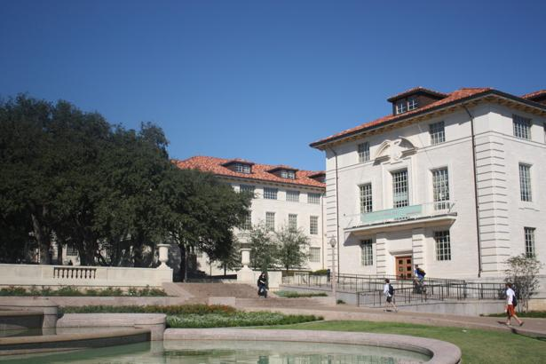
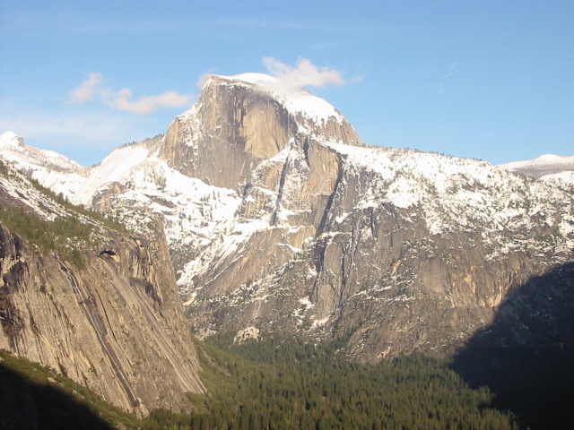
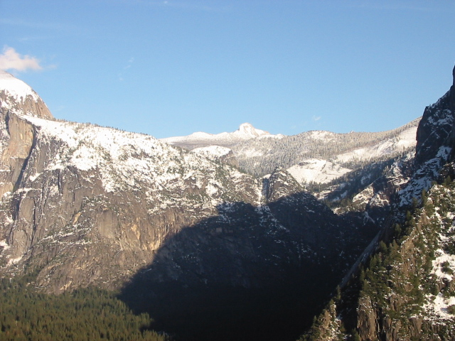

# 高聖倫 <span style="color:red">(106061851)</span>

# Project 2 / Panorama Stitching

## Overview
The project is related to 
> The image techniqe of panorama, stitch the images from different views.


## Implementation
### 1. Matching SIFT Descriptors
- Calculate Euclidean distance between a given SIFT descriptor from image1 and all SIFT descriptors from image2.
- If the distance to the closest vector is smaller (multiply by a factor) than the distance to the second-closest, we stack it into "match".
- SIFTSimpleMatcher.py:
    ```python
    match = []
    c=0
    N1= descriptor1.shape[0]
    N2= descriptor2.shape[0]
    for i in range(N1):
        tmp = np.tile(descriptor1[i,:],(N2,1))
        dist = np.sqrt((np.square(tmp-descriptor2)).sum(axis=1))
        x_position = np.argmin(dist)
        x = dist[x_position]
        y = min(np.delete(dist,x_position))
        if x < y*THRESH:
            match = np.append(match,[i,x_position])
            c=c+1
    match=np.reshape(match,(c,2))
    ```

### 2. Fitting the Transformation Matrix
- Given P1' * H' = P2', we need to calculate H using linalg.lstsq() function.
- ComputeAffineMatrix.py:
	```python
	H = np.linalg.lstsq(P1.T, P2.T)[0]
	H = H.T
	```

### 3. RANSAC
- Expend pt1 and pt2 to p1 and p2, then calculate the Euclidean distance between (H * p1) and p2.
- RANSACFit.py:
    ```python
    dists = np.zeros(match.shape[0])
    matched_p1 = pt1[match[:,0].astype('int64')]
    matched_p2 = pt2[match[:,1].astype('int64')]
    p1 = np.concatenate([matched_p1.T, np.ones([1, len(matched_p1)])], axis=0)
    p2 = np.concatenate([matched_p2.T, np.ones([1, len(matched_p2)])], axis=0)

    Hp1 = np.matmul(H,p1)
    dists = np.sqrt((np.square(Hp1.T- p2.T)).sum(axis=1))  
    ```

### 4. Stitching Multiple Images (in ordered sequence)
- If currentFrameIndex < refFrameIndex, then multiply all the transformation matrix from current to reference.
- If refFrameIndex < currentFrameIndex, then multiply all the inverse transformation matrix from reference to current.
- MultipleStitch.py:
    ```python
    if currentFrameIndex < refFrameIndex:
        for i in range(currentFrameIndex , refFrameIndex):
            T = np.dot(T,i_To_iPlusOne_Transform[i])
    else:
        for i in range(currentFrameIndex-1,refFrameIndex-1,-1):
            T = np.dot(np.linalg.inv(i_To_iPlusOne_Transform[i]),T)
    ```
	
	
## Installation
* Required files: `SIFTSimpleMatcher.py`, `ComputeAffineMatrix.py`, `RANSACFit.py`, `MultipleStich.py`
* Other required packages: `numpy`, `matplotlib`, `PIL`, `cyvlfeat`
Install cyvlfeat toolbox: conda install -c menpo cyvlfeat

* How to compile from source?: Run the code `TransformationTester.py` and `StichTester.py`, and the output image will be saved in `.\results` folder.


### Results
### Panorama Stiching
The results of image stiching are shown below.
- Hanging

	|Original Image1|Original Image2|
	|:---:|:---:|
	|||

	|__Panorama Stiching__|
	|:---:|
	||

- Melakwa Lake

	|Original Image1|Original Image2|
	|:---:|:---:|
	|||

	|__Panorama Stiching__|
	|:---:|
	||

- Rainier

	|Original Image1|Original Image2|Original Image3|Original Image4|Original Image5|Original Image6|
	|:---:|:---:|:---:|:---:|:---:|:---:|
	|||||||

	|__Panorama Stiching__|
	|:---:|
	||
	
- UT Tower

	|Original Image1|Original Image2|
	|:---:|:---:|
	|||

	|__Panorama Stiching__|
	|:---:|
	||

- Yosemite National Park

	|Original Image1|Original Image2|Original Image3|Original Image4|
	|:---:|:---:|:---:|:---:|
	|||||

	|__Panorama Stiching__|
	|:---:|
	||